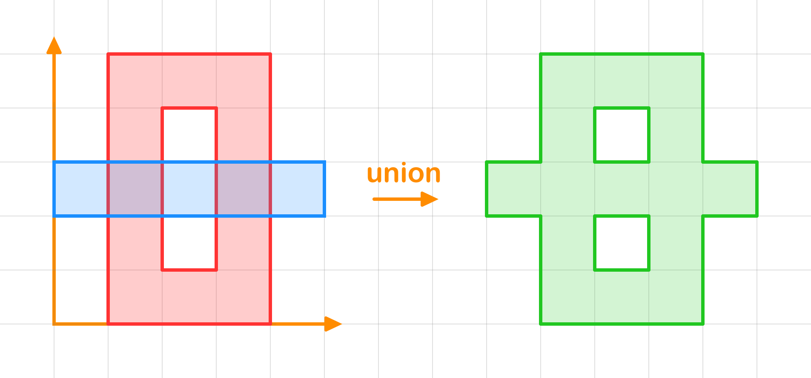

# iOverlay

[](https://crates.io/crates/i_overlay)
[](https://docs.rs/i_overlay)


The iOverlay library provides high-performance boolean operations on polygons, including **union**, **intersection**, **difference**, and **xor**. It is designed for applications that require precise polygon operations, such as computer graphics, CAD systems, and geographical information systems (GIS). By supporting both integer (`i32`) and floating-point (`f32`, `f64`) APIs, iOverlay offers flexibility and precision across diverse use cases.  

*For detailed performance benchmarks, check out the* [Performance Comparison](https://ishape-rust.github.io/iShape-js/overlay/performance/performance.html)


## [Documentation](https://ishape-rust.github.io/iShape-js/overlay/stars_demo.html)
Try out iOverlay with an interactive demo:

- [Stars Rotation](https://ishape-rust.github.io/iShape-js/overlay/stars_demo.html)
- [Shapes Editor](https://ishape-rust.github.io/iShape-js/overlay/shapes_editor.html)


## Features

- **Boolean Operations**: union, intersection, difference, and exclusion.
- **String Line Operations**: clip and slice.
- **Polygons**: with holes, self-intersections, and multiple contours.
- **Simplification**: removes degenerate vertices and merges collinear edges.
- **Fill Rules**: even-odd, non-zero, positive and negative.
- **Data Types**: Supports i32, f32, and f64 APIs.

## Getting Started

Add the following to your Cargo.toml:
```
[dependencies]
i_overlay = "^1.8"
```

### Simple Example


Here's an example of performing a union operation between two polygons:

```rust
// Define the subject "O"
let subj = [
    // main contour
    vec![
      [1.0, 0.0],
      [1.0, 5.0],
      [4.0, 5.0],
      [4.0, 0.0], // the contour is auto closed!
    ],
    // hole contour
    vec![
      [2.0, 1.0],
      [3.0, 1.0],
      [3.0, 4.0],
      [2.0, 4.0], // the contour is auto closed!
    ],
];

// Define the clip "-"
let clip = [
    // main contour
    [0.0, 2.0],
    [5.0, 2.0],
    [5.0, 3.0],
    [0.0, 3.0], // the contour is auto closed!
];

let result = subj.overlay(&clip, OverlayRule::Union, FillRule::EvenOdd);

println!("result: {:?}", result);
```
The result is a vec of shapes:
```rust
[
    // first shape
    [
        // main contour (clockwise order)
        [
            [0.0, 2.0], [0.0, 3.0], [1.0, 3.0], [1.0, 5.0], [4.0, 5.0], [4.0, 3.0], [5.0, 3.0], [5.0, 2.0], [4.0, 2.0], [4.0, 0.0], [1.0, 0.0], [1.0, 2.0]
        ],
        // first hole (counterclockwise order)
        [
            [2.0, 2.0], [2.0, 1.0], [3.0, 1.0], [3.0, 2.0]
        ],
        // second hole (counterclockwise order)
        [
            [2.0, 4.0], [2.0, 3.0], [3.0, 3.0], [3.0, 4.0]
        ]
    ]
    // ... other shapes if present
]
```
The `overlay` function returns a `Vec<Shapes>`:

- `Vec<Shape>`: A collection of shapes.
- `Shape`: Represents a shape made up of:
  - `Vec<Contour>`: A list of contours.
  - The first contour is the outer boundary (clockwise), and subsequent contours represent holes (counterclockwise).
- `Contour`: A sequence of points (`Vec<P: FloatPointCompatible>`) forming a closed contour.

**Note**: Outer boundary contours have a clockwise order, and holes have a counterclockwise order. [More information](https://ishape-rust.github.io/iShape-js/overlay/contours/contours.html) about contours. 


### Custom Point ###
`iOverlay` allows users to define custom point types, as long as they implement the `FloatPointCompatible` trait.
```rust
#[derive(Clone, Copy, Debug)]
struct CustomPoint {
  x: f32,
  y: f32,
}

impl FloatPointCompatible<f32> for CustomPoint {
  fn from_xy(x: f32, y: f32) -> Self {
    Self { x, y }
  }

  fn x(&self) -> f32 {
    self.x
  }

  fn y(&self) -> f32 {
    self.y
  }
}

let subj = [
    CustomPoint { x: 0.0, y: 0.0 },
    CustomPoint { x: 0.0, y: 3.0 },
    CustomPoint { x: 3.0, y: 3.0 },
    CustomPoint { x: 3.0, y: 0.0 },
];

let clip = [
    CustomPoint { x: 1.0, y: 1.0 },
    CustomPoint { x: 1.0, y: 2.0 },
    CustomPoint { x: 2.0, y: 2.0 },
    CustomPoint { x: 2.0, y: 1.0 },
];

let result = subj.overlay(&clip, OverlayRule::Difference, FillRule::EvenOdd);

println!("result: {:?}", result);
```
### Slicing a Polygon by a String Line

```rust
let polygon = [
    [1.0, 1.0],
    [1.0, 4.0],
    [4.0, 4.0],
    [4.0, 1.0],
];

let slicing_line = [
    [3.0, 5.0],
    [2.0, 2.0],
    [3.0, 3.0],
    [2.0, 0.0],
];

let result = polygon.slice_by(&slicing_line, FillRule::NonZero);

println!("result: {:?}", result);
```
### Clip a String Lines by a Polygon

```rust
let polygon = [
    [1.0, 1.0],
    [1.0, 4.0],
    [4.0, 4.0],
    [4.0, 1.0],
];

let string_line = [
    [3.0, 5.0],
    [2.0, 2.0],
    [3.0, 3.0],
    [2.0, 0.0],
];

let clip_rule = ClipRule { invert: false, boundary_included: false };
let result = string_line.clip_by(&polygon, FillRule::NonZero, clip_rule);

println!("result: {:?}", result);
```
# Overlay Rules


### Union, A or B


### Intersection, A and B


### Difference, A - B


### Inverse Difference, B - A


### Exclusion, A xor B

